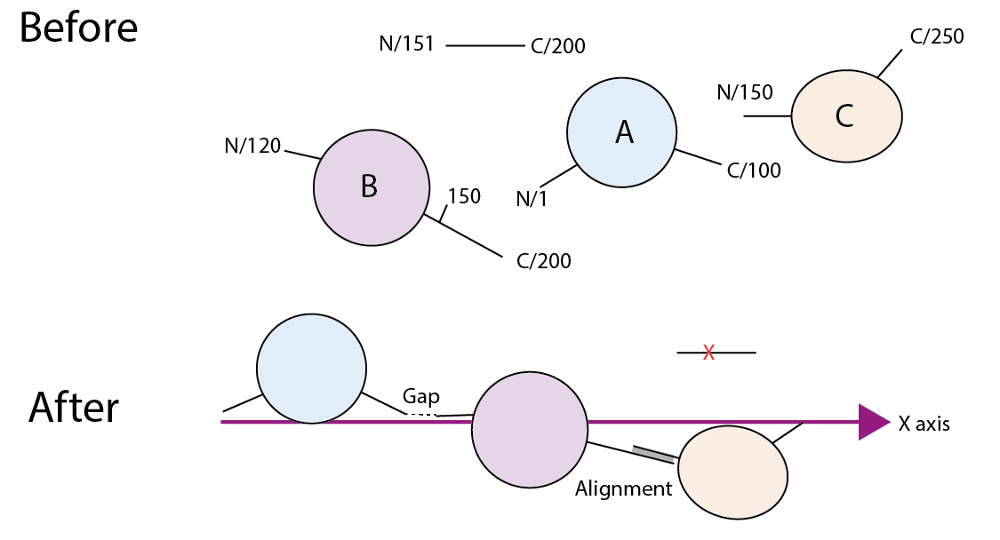

# protein_fuser
A py3 script to fuse structures together.

This script, best run in a Jupyter notebook, requires pymol within your py environment, which can be installed with conda.
This is not a PyMOL script, but a Python3 script that uses `module pymol2`.

## Raison d'être

Human protein, in particular, are often huge multidomain protein, like beads on a string. Each domain crystallised separately.
Although it is important to use the primary source, it is sometimes beneficial to stitch domains together for a **simple** illustration without the confusion of separate images of say model A with domain X solved at 2.1 &Aring; while model B is an NMR of domain Y bound to protein 2, _etc._

If Rosetta remodel or the ITasser DEMO tool is used, the protein ends up looking like a tangle and not like aligned beads.

A nice analogy are the planets. When pictured they are in syzygy, 
which is actually extremely rare or impossible depending on how precisely one expects them to align.

This script does the following:

* Finds which bits to use based on length, start, stop and tier &mdash; resolution and missing loops are not taken into account.
* Aligns models that can be aligned due to overlap, with shifts and, if need be, rotation, to find the best two overlapping amino acids to stitch the protein together.
* Places the N and C termini of each model-agglomerate on the x axis `(x, 0, 0)`.
* If there is a gap it projects the N terminus of the next model by missingAA &times; 3.5^0.5 &Aring; away from the C terminus of the previous. If there is a clash, the model is rotate/pushed out until it is okay.

The resulting protein will be chain A. With any other chains being from the biologically assembly if present.
At present it does not play with the partners, although in future it would be nice if it gathered binding partners too. The metadata comes from the PDBe API and albeit the gene symbols are a bit of a mess they are definitely matchable.

The attribute `ws.joints` contains information of what came from where.

**CAVEAT** It is essential that you let any viewer know that your protein is a Frankenstein protein and it is not known how the bits fit together.

## Input

The input is made to be compatible with my Uniprot parser (see [protein-module-for-VENUS](https://github.com/matteoferla/protein-module-for-VENUS)).
This is slightly odd in that it is for use with the NextProt featureViewer ([ref](https://github.com/calipho-sib/feature-viewer)), so the pdb is a list of dictionaries with keys `id`, `x`, `y`, `description` &mdash;description is not used, while id value is `(?PDB|SWISSMODEL|LOCAL:)<code>_<chain>` format, _e.g._ `1WG7_A` or `PDB:1WG7_A` or `1WG7` or `SWISSMODEL:5bf8103b02efd001eeb29f09` or `LOCAL:myfile.pdb`. Additionally, the field `tier` can be added to specify priority. _E.g._ a Phyre2 model is less reliable than a PDB model, so the PDB model should be trusted more, so the user would specify a lower tier (e.g. `1` vs. `2`).

### Alt: Uniprot

Alternatively, it can be started with a uniprot id with `Fuser.from_uniprot(uniprot)`.

## PyMOL requirement

This module requires pymol as a python3 module. Ie. installed with conda (`pymol2` module comes with `pymol`),
not as the downloaded GUI application.
The classes Fuser and Model require a `pymol2.SingletonPyMOL` instance to work.
To do so assign the pymol instance to `Fuser.pymol` class attribute.
The parallel `pymol2.PyMOL` will not work as it is unable to rototranslate.

    import pymol2
    with pymol2.SingletonPyMOL() as pymol:
            Workshop.pymol = pymol

## Fuser class

	fuser = Fuser(pdbs, debug).order().save()

* `debug`: verbosity boolean
* `pdbs`: `[{'x': stated_start_in_uniprot,
    'y': stated_end_in_uniprot,
    'id': 'code_chain', 
    'tier': opt. int. low => max importance (e.g. crystal), high => lower importance (e.g. models)
    'description': opt. 'Not used.'}]`

In the case of PDBs the metadata is taken in order to find where the true start is without cloning scars.
The code can be a PDB code. or `PDB:code`  or `SWISSMODEL:id` or `LOCAL:filename` (without underscores!)

For PDB codes, the metadata is fetched to verify what the true values are. While for swissmodel and local it is assumed that the first residue that exists in the model is the `x` in the input.
Note that Uniprot and PDBe metadata `x` refers to the first residue in the cif file sequence, regardless of existence in the solved structure as is often not the case.

`fs.order()` readies and aligns and projects the non-redudant models. The all in one workhorse.
the init step actually calls `fs.categorise()` which categorises the models based on redundancy.
`fs.ready_models()` loads models
`fs.align_models()` aligns overlapping ones
`fs.project_models()` places models with gaps along the x-axis.
`fs.models` list of models.
For various reasons, `model.code` is what is used to fetch/load/pdbstr, while `model.name` is the name of the model within PyMol.
See model for more about the madness.

Note that there is not a `pymol.cmd.create` step to fuse the parts as simply saving as pdb will do it and instead saving as pse to check things is nice or if there is a version mismathc with pymol (_i.e._ system = Pymol1.8, python pymol2) `pymol.exporting.multisave('tmp.pdb')` is a handy command.

Model has many bound methods that use pymol cmds, that affect only one model, say `protein.roll(40)`. while fuser uses more than once say, `fs.roll_free(protein_A, protein_B)`.

Some methods act on all models and will have `_models` in the name.

* `fs.ready_models()` --> `model.fetch_n_clean()`
* `fs.align_models()` --> `ws.align(A,B)`
* `fs.project_models()` --> `ws.project(A,B)`

`ws.show_pose()` is a Jupyter notebook specific thing of mine as I am running in headless mode. Namely, it calls `pymol.cmd.save`, waits for the async function to do its thing and load the image as a `display(Image(filename))`.

## Model

 Init just stores the variables. but `model.fetch_and_clean()` does all the work loading the structure by calling:

* `model.kill_states()`    ---> use only state 1.
* `model.move_away_hetatm()`  ---> protect the hetatms ligands!
* `model.clean_Nterminus()`   ---> trim the linkers!
* `model.clean_Cterminus()`
* `model.fix_numbers()`   --> the numbering off quite frequently...
* `model.shift_to_true_Nterminus()`  ---> gets rid of unsolved terminus
* `model.shift_to_true_Cterminus()`  ---> gets rid of unsolved terminus

While other methods are called by the project method of fuser. Say all the angle operations.
e.g. `model.roll(n)` or `model.get_resi_coords(resi)`. 
A method to keep an eye for is `model.angle_fix()`. This ensures that the the N and C termini are on the x axis.
        
The code can be a PDB code. or... PDB:code  or SWISSMODEL:id or LOCAL:filename (without underscores!)

There are three sets of numbers.
uniprot start (`x`) which is the position in the whole protein of the first real residue based on the stated sequence regardless of density.
start (`start`) which is the first residue stated in PDBe query based on the stated sequence regardless of density.
Namely... the mapping start is at what residue index within the model does the match start,
while uniprot start is what the position that residues has in the whole sequence.

## Example
	
	uniprot = 'Q00341' ## vigilin
	import pymol2, warnings
    with pymol2.SingletonPyMOL() as pymol:
        Workshop.pymol = pymol
        f = Fuser.from_uniprot(uniprot, debug=False)
        for m in f.models:
            print(m)
        f.order()
        f.save()
        for m in w.models:
            print(m)
        f.add_xyz()
        pymol.cmd.save('test.pse')
        print(f.joints)
        print(f.old2new)
        print('done')

## Next

* I have code to make Rosetta add the missing loops that may be nice to add: see [blog post with code](http://blog.matteoferla.com/2020/07/filling-missing-loops-proper-way.html)
* I have code to make Rosetta add the post translation modifications that may be nice to add.
* I would like to automatedly choose the binding partners
* I would like to run the script on the whole of the human PDB, with SWISSMODEL, Phyre2 (they have a nice amount thanks to Miscast!) and I-TASSER*

&lowast; I have written a [scraper for I-Tasser](https://github.com/matteoferla/ITasser_miner), which I think is legally okay, but I need to find out.

